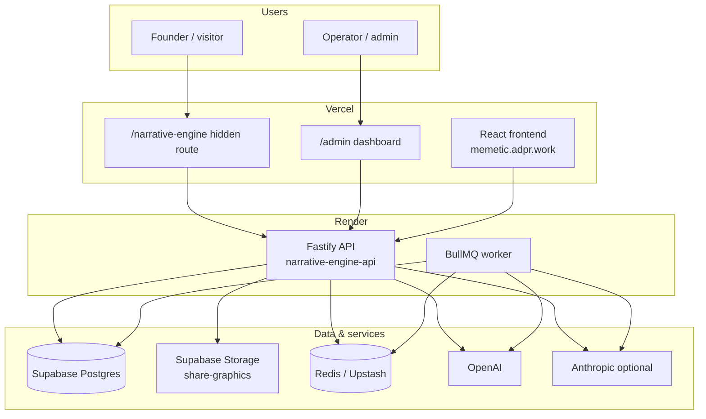
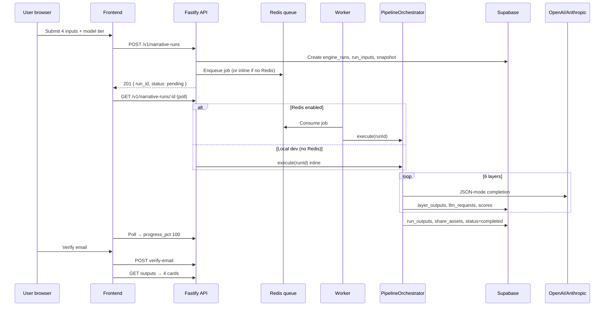
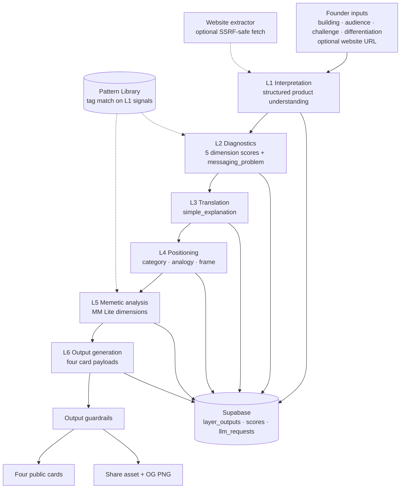
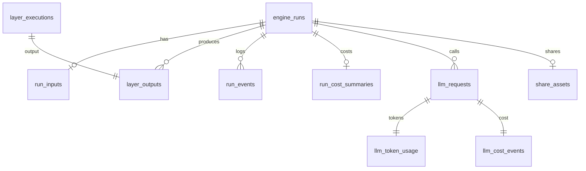

# Narrative Engine — Architecture

**Status:** Implemented (V1 Beta)  
**Related:** [PRD](./PRD.md) · [TDD](./TDD.md) · [database-spec](./database-spec.md) · [deployment](./deployment.md) · [Vision doc](../../ADPR-MBL%20Docs/Narrative_Engine_Architecture_and_Vision.md)

---

## 1. What it is

The Narrative Engine (NE) is a **Communication Intelligence Diagnostic** — not a generic copywriter or meme generator. It **diagnoses first, then generates**: founders submit how they explain their product; a six-layer LLM pipeline interprets, scores, and reframes that narrative; the user receives **four structured cards**.

| Principle | Meaning |
|-----------|---------|
| Diagnose → Generate | Internal scores and patterns stay hidden; cards are the deliverable |
| Clarity over cleverness | Outputs must pass a “12-year-old understands it” bar |
| Full lineage | Every run, layer, token, and cost is persisted for audit and tuning |

**Product ladder (context):**

```
Narrative Engine (Beta) → Memetic Brand Workshop → CI OS → Memetic Engine (future)
```

---

## 2. System context



| Surface | URL | Visibility |
|---------|-----|------------|
| Marketing site | `/` | Public |
| Narrative Engine UI | `/narrative-engine` | Direct URL only in production (no nav links) |
| Run progress + cards | `/narrative-engine/run/:id` | Session / email-gated |
| Public share | `/results/:shareId` | Public when share exists |
| Admin dashboard | `/admin` | `X-Admin-Key` gate |

---

## 3. Repository layout

```
memetic-brand-labs/
├── frontend/                 # React + Vite marketing site + NE + admin UI
│   └── src/
│       ├── pages/            # NarrativeEnginePage, NarrativeRunPage, SharedResultPage
│       ├── admin/            # Ops dashboard (status, runs, costs, config)
│       └── lib/              # narrativeApi.js, featureFlags.js
├── narrative-engine-api/     # Fastify TypeScript API + pipeline
│   ├── config/narrative-engine/   # Source of truth: prompts, schemas, enums
│   └── src/
│       ├── orchestrator/     # PipelineOrchestrator
│       ├── jobs/             # BullMQ queue + worker
│       ├── llm/              # LLMRouter (OpenAI / Anthropic)
│       ├── patterns/         # PatternRetriever
│       ├── telemetry/        # Events, token/cost tracking
│       ├── share/            # Share URLs + OG graphic rendering
│       └── routes/           # Public + admin HTTP routes
├── supabase/                 # Migrations, seed, pattern loader
├── docs/narrative-engine/    # Specs (this file, PRD, TDD, deployment, …)
└── render.yaml               # Render Blueprint (API + worker)
```

---

## 4. Runtime architecture

### 4.1 Request lifecycle (happy path)



### 4.2 API service (`narrative-engine-api`)

| Concern | Implementation |
|---------|----------------|
| HTTP | Fastify 5, CORS, Helmet |
| Config | `loadEnv()` (Zod) — Supabase, LLM keys, Redis, admin key |
| Auth | Optional Supabase JWT; session via `x-session-id` |
| Admin | `X-Admin-Key` header → `/v1/admin/*` |
| Jobs | `enqueueRun()` → BullMQ or `processRunInline()` |

**Worker split (production):**

| Service | `WORKER_MODE` | Role |
|---------|---------------|------|
| Render web | `false` | HTTP only; enqueues jobs |
| Render worker | `true` | Consumes `narrative-pipeline` queue |

### 4.3 Frontend (`frontend/`)

| Module | Role |
|--------|------|
| `narrativeApi.js` | REST client → `VITE_API_URL` |
| `featureFlags.js` | Hides NE discovery links in production builds |
| `NarrativeEnginePage` | Form: building, audience, challenge, differentiation, tier |
| `NarrativeRunPage` | Progress polling, email gate, card display |
| `admin/*` | Internal ops UI (health, runs, costs, config) |

---

## 5. Pipeline architecture

The core is **`PipelineOrchestrator`** — a sequential, six-layer LLM pipeline. Each layer has a versioned prompt, JSON schema, and validated output stored in Postgres.

### 5.1 Layer flow



### 5.2 Layers (implementation)

| # | Layer key | Stage label (UX) | Output purpose | Public |
|---|-----------|------------------|----------------|--------|
| 1 | `interpretation` | Analyzing communication… | Core function, audience, category, complexity | No |
| 2 | `diagnostics` | Detecting positioning gaps… | Scores 0–100 on 5 dimensions; `messaging_problem` enum | No |
| 3 | `translation` | Analyzing communication… | One-sentence plain-language explanation | Partial → card |
| 4 | `positioning` | Generating narrative directions… | Category frame, optional analogy | Partial → card |
| 5 | `memetic_analysis` | Generating narrative directions… | MM Lite weighted dimensions | Partial → card |
| 6 | `output_generation` | Finalizing… | Final copy for all four cards | Yes |

**Progress mapping** (`STAGE_PROGRESS` in `types/index.ts`): frontend polls `progress_pct` and `current_stage` on `engine_runs`.

### 5.3 Four output cards

| Card key | User-facing label | Source layers |
|----------|-------------------|---------------|
| `clear_explanation` | Clear Explanation | translation + output_generation |
| `positioning` | Positioning Direction | positioning + output_generation |
| `messaging_hook` | Messaging Hook | output_generation |
| `memetic_angle` | Memetic Narrative Angle | memetic_analysis + output_generation |

Diagnostic scores and raw layer JSON are **never returned** by public API routes.

### 5.4 Per-layer execution (`runLayer`)

For each layer:

1. **Resolve variables** — founder inputs, prior layer JSON, matched patterns (`VariableResolver`)
2. **Build prompt** — system prompt from `config/narrative-engine/prompts.json` + `formatSchemaInstruction(schema)`
3. **Route model** — tier from `pricing_tiers.model_routing` (fast / standard / quality)
4. **LLM call** — OpenAI `json_object` or Anthropic for Claude models (`LLMRouter`)
5. **Validate** — AJV against layer schema (`SchemaValidator`)
6. **Persist** — `layer_executions`, `layer_outputs`, `layer_prompt_snapshots`, `llm_requests`, costs
7. **Emit telemetry** — `run_events`, `diagnostic_scores` / `memetic_lite_scores` where applicable

### 5.5 Pattern Library (V1)

`PatternRetriever` filters `pattern_entries` by tags derived from L1 (`market`, `category`, `messaging_problem`). ~30 seeded patterns (failure, success, behaviour, cultural). Injected into L2 and L5 prompts — **not** shown to users.

### 5.6 Guardrails & share

- **`OutputGuardrailService`** — blocks off-brand patterns (meme slang, virality claims) before cards are saved
- **`ShareService` + `GraphicRenderer`** — creates `share_id`, stores OG PNG in `share-graphics` bucket

---

## 6. Configuration architecture

**Source of truth:** `narrative-engine-api/config/narrative-engine/`

```
config/narrative-engine/
├── meta.json          # Engine version, master role, principles
├── enums.json         # messaging_problem, category, market, …
├── prompts.json       # Per-layer system + user templates
└── schemas/           # ne.interpretation.v1.json, …
```

| Command | Effect |
|---------|--------|
| `npm run config:generate` | SQL seed + mirror schemas → `supabase/seed/` |
| `npm run config:sync` | Upsert prompts/schemas/enums to Supabase tables |
| Runtime | `narrativeConfig.ts` loads files; orchestrator uses at execution time |

DB tables (`prompt_templates`, `schema_registry`, `enum_definitions`) mirror config for admin inspection and future hot-reload; **runtime reads canonical JSON files**.

---

## 7. Data architecture



**Design principles** (see [database-spec.md](./database-spec.md)):

1. Full lineage: user → session → run → layer → LLM → output  
2. Immutable `run_config_snapshots` per run  
3. Append-only `run_events`  
4. One `llm_requests` row per API call  
5. Admin views: `v_run_full_audit`, `v_cogs_vs_revenue_daily`, `v_model_tier_performance`

---

## 8. API surface

### Public (`/v1/`)

| Method | Path | Purpose |
|--------|------|---------|
| GET | `/health` | Liveness |
| GET | `/v1/pricing-tiers` | Model tier options |
| POST | `/v1/narrative-runs` | Start analysis |
| GET | `/v1/narrative-runs/:id` | Status + outputs (if email verified) |
| GET | `/v1/narrative-runs/:id/outputs` | Cards + share URL |
| POST | `/v1/narrative-runs/:id/verify-email` | Email gate |
| POST | `/v1/narrative-runs/rerun` | Paid rerun (x402 / 402) |
| GET | `/v1/results/:shareId` | Public share payload |
| GET | `/v1/results/:shareId/graphic.png` | OG image |
| DELETE | `/v1/me/runs/:id` | User deletion |

### Admin (`/v1/admin/` — `X-Admin-Key`)

| Method | Path | Purpose |
|--------|------|---------|
| GET | `/health` | Service status + recent events |
| GET | `/stats` | COGS, runs, tiers, daily rollups |
| GET | `/runs` | Paginated run list |
| GET | `/runs/:id` | Run detail |
| GET | `/runs/:id/layers` | Full layer audit |
| GET | `/llm-requests` | Per-run LLM log |
| GET | `/config` | Prompts, schemas, tiers |
| GET | `/patterns` | Pattern library |

OpenAPI: [openapi.yaml](./openapi.yaml)

---

## 9. Security model

| Layer | Control |
|-------|---------|
| Public API | No diagnostic scores in responses; share view uses `v_public_share` |
| RLS | User-owned rows protected; API uses service role for pipeline writes |
| Admin | `ADMIN_API_KEY` header; future Supabase `admin` role via JWT |
| Website fetch | SSRF-safe `HomepageExtractor` (allowlist, timeouts) |
| Secrets | `.env` gitignored; Render/Vercel env for production |
| CORS | `CORS_ORIGIN` locked to frontend domain(s) |

---

## 10. Deployment topology (production)

| Component | Host | Notes |
|-----------|------|-------|
| Frontend | Vercel (`frontend/`) | `VITE_API_URL` → Render |
| API | Render web service | `WORKER_MODE=false` |
| Worker | Render worker | `WORKER_MODE=true`, same `REDIS_URL` |
| Queue | Upstash Redis (free tier) | BullMQ `narrative-pipeline` |
| Database | Supabase Postgres | Migrations + seed |
| Storage | Supabase `share-graphics` | Public read for OG images |
| LLM | OpenAI (+ Anthropic for quality tier) | Keys on Render only |

See [deployment.md](./deployment.md) for step-by-step setup.

---

## 11. Observability & operations

| Signal | Where |
|--------|-------|
| Run progress | `engine_runs.progress_pct`, `current_stage` |
| Pipeline trace | `run_events` (stage.entered, llm.completed, run.completed) |
| Cost per run | `run_cost_summaries`, `llm_cost_events` |
| Admin UI | `/admin` — status, runs, costs, config |
| Smoke test | `narrative-engine-api/scripts/smoke-test.sh` |

---

## 12. Model tiers

Configured in `pricing_tiers` with per-layer `model_routing` JSON:

| Tier | Typical use | Routing |
|------|-------------|---------|
| `fast` | First free run | `gpt-4o-mini` default |
| `standard` | Reruns | `gpt-4o` |
| `quality` | Premium | `gpt-4o` + Claude for memetic layer |

`CostCalculator` records token usage and USD cost per `llm_requests` row.

---

## 13. Extension points (future)

Designed so NE does not block CI OS / Memetic Engine:

| Area | V1 | Future |
|------|-----|--------|
| Pattern retrieval | Tag filter | pgvector semantic search |
| Meme Metrics | MM Lite in L5 only | Full scoring in CI OS |
| Auth | Session + email gate | Supabase Auth + wallet (x402 reruns) |
| Config | File-based + DB mirror | Admin activate prompt versions |
| Engines | `engine_type = narrative` | Additional engine types on same schema |

---

## 14. Key files (quick reference)

| File | Responsibility |
|------|----------------|
| `PipelineOrchestrator.ts` | Six-layer pipeline execution |
| `queue.ts` | Job enqueue + inline fallback |
| `narrativeConfig.ts` | Prompt/schema loader |
| `RunService.ts` | Run CRUD, email verification |
| `TelemetryService.ts` | Events, LLM request logging, cost rollup |
| `PatternRetriever.ts` | Pattern injection |
| `frontend/src/lib/narrativeApi.js` | Browser API client |
| `supabase/migrations/*.sql` | Schema + RLS + views |
