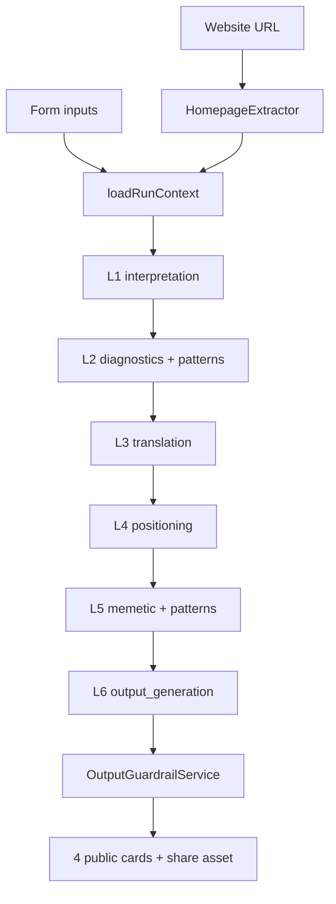

# Narrative Engine — Prompt Optimisation

**Status:** Implemented in code (v1.2.0 prompts) — sync to Supabase via `npm run config:all` before production  
**Related:** [architecture](./narrative-engine/architecture.md) · [feature-development](./narrative-engine/feature-development.md) · [Vision doc](../ADPR-MBL%20Docs/Narrative_Engine_Architecture_and_Vision.md) · Anand source docs (`ADPR-MBL Docs/*.docx` — not in repo as markdown)

This document tracks prompt/orchestration gaps versus Anand’s original Narrative Engine spec and the phased plan used to close them.

### Implementation notes (2026-07-12)

Shipped safely without breaking schema contracts:

| Area | Done? | Notes |
|------|-------|-------|
| Phase 1 wiring | Yes | L2 founder inputs + enum; L3/L4 patterns injected; DB prompt lookup documented as version-only |
| Phase 2 website compare | Yes | Expanded `computeMismatchFlags`; flags + website passed to L1/L2 |
| Phase 3 enrichment + steering | Yes | Richer prompts; `diagnostic_summary` for L3–L6 |
| Phase 3 hard schema tighten | **Skipped** | Avoid AJV maxLength / new required L1 fields that would fail live runs |
| Phase 4 L3/L4 patterns | Yes | Via `PATTERN_INJECTION_LAYERS` |
| Backend tests | Yes | `promptOptimisation`, `promptWiring`, `homepageExtractor` (+ existing suites) |

**Deploy reminder:** API redeploy required for orchestrator/extractor changes; also run `cd narrative-engine-api && npm run config:all` against the target Supabase so admin mirrors match filesystem prompts.

---

## 1. Executive summary

The implementation faithfully captures Anand’s six-layer diagnose-then-generate architecture, master prompt, enums, pattern library concept, and four-card output. The main gaps versus the original vision are:

1. **Website comparison is shallow** and stops at L1.
2. **L2 does not see** raw founder inputs, website context, or `mismatch_flags`.
3. **L3 `{{patterns}}`** is in the template but always empty.
4. **Prompt word limits** are not enforced in schemas (e.g. L3 “≤15 words” vs 200-char `maxLength`).
5. **L3–L6 lack targeted diagnostic steering** — they get full `prior_layers` JSON but no emphasis on L2 scores/findings.
6. **Prompts are shorter** than the original doc’s worked examples and negative constraints.

Closing those gaps would move outputs from “structurally correct” toward “realistic and differentiated.”

---

## 2. Where prompts live (code vs docs)

### Canonical runtime prompts (what the pipeline actually uses)

| Source | Role |
|--------|------|
| [`narrative-engine-api/config/narrative-engine/prompts.json`](../narrative-engine-api/config/narrative-engine/prompts.json) | Per-layer `system_addon` + `user_prompt_template` |
| [`narrative-engine-api/config/narrative-engine/meta.json`](../narrative-engine-api/config/narrative-engine/meta.json) | Master role, quality bar, principles (prepended to every layer) |
| [`narrative-engine-api/config/narrative-engine/enums.json`](../narrative-engine-api/config/narrative-engine/enums.json) | Allowed enum keys injected into L1 (only layer with `enum_fields` today) |
| [`narrative-engine-api/config/narrative-engine/schemas/*.json`](../narrative-engine-api/config/narrative-engine/schemas/) | JSON output contracts appended to each system prompt at runtime |
| [`narrative-engine-api/src/config/narrativeConfig.ts`](../narrative-engine-api/src/config/narrativeConfig.ts) | Composes final system prompts + schema instructions |
| [`narrative-engine-api/src/orchestrator/defaultPrompts.ts`](../narrative-engine-api/src/orchestrator/defaultPrompts.ts) | Thin re-export of config (not separate prompt text) |
| [`narrative-engine-api/src/orchestrator/PipelineOrchestrator.ts`](../narrative-engine-api/src/orchestrator/PipelineOrchestrator.ts) | Resolves variables, calls LLM, validates, persists |
| [`narrative-engine-api/src/orchestrator/VariableResolver.ts`](../narrative-engine-api/src/orchestrator/VariableResolver.ts) | `{{building}}`, `{{website_context}}`, etc. |

### DB mirror (admin / inspection — not used for prompt text at runtime)

Tables `prompt_templates`, `schema_registry`, and `enum_definitions` are synced via `npm run config:sync`.

**Important:** the orchestrator queries `prompt_templates` but always uses `getPromptForLayer()` from JSON files for prompt text; only version metadata can come from the DB.

### Anand’s original prompt ideation (docs)

| Document | What it contains |
|----------|------------------|
| `ADPR-MBL Docs/Adpr MBL_Narrative Engine Backend Prompt Logic_v2.docx` | Full 6-layer logic, master prompt, per-layer instructions, pattern library design, example I/O |
| `ADPR-MBL Docs/Adpr Meme Brand Project Website Structure_Prompt_Logic_V12.docx` | Product/UX framing, NE form fields, 4 cards, “Your Website” field |
| `ADPR-MBL Docs/Narrative_Engine_Architecture_and_Vision.md` | Consolidated architecture spec (merged from V8/V12/PDF/backend docs) |
| [`docs/narrative-engine/architecture.md`](./narrative-engine/architecture.md) | Implementation-aligned architecture doc |

---

## 3. Docs vs implementation — gap analysis

### Master prompt & principles

Anand’s doc:

> “You are a narrative compression engine for complex technology startups…”  
> Secret bar: “Rewrite so a 12-year-old can understand it. If it passes that test, it spreads.”

Implemented in `meta.json` — matches closely:

```json
{
  "version": "1.1.0",
  "engine_type": "narrative",
  "master_role": "You are a narrative compression engine for complex technology startups.",
  "quality_bar": "Rewrite startup messaging so a 12-year-old could understand it. If it passes that test, it spreads.",
  "principles": [
    "Clarity over cleverness",
    "Simplicity over jargon",
    "One core idea per sentence",
    "Memorable phrasing",
    "Analogies founders and investors recognize"
  ]
}
```

### Six-layer architecture

| Layer | Anand’s intent | Implemented? | Gap |
|-------|----------------|--------------|-----|
| **L1 Interpretation** | Extract core function, audience, outcome, category, complexity, market, communication risk | Yes, as `messaging_problem` enum | No explicit differentiation or `communication_risk` field in schema |
| **L2 Diagnostics** | Score 5 dimensions 0–100; findings; use Pattern Library | Yes | Does not receive raw founder inputs or website — only L1 JSON |
| **L3 Translation** | Outcome-first, everyday language, ≤15 words | Yes | Template has `{{patterns}}` but patterns are never injected for L3 |
| **L4 Positioning** | Category + optional analogy; avoid forced “Uber for X” | Yes | Guardrails flag forced analogies post-hoc, not in prompt |
| **L5 Memetic** | Familiarity, contrast, shared truth, participation + MM Lite scores | Yes | Aligned with vision doc |
| **L6 Output** | Assemble 4 cards; one hook sentence | Yes | L4 still generates 3 `narrative_hooks`; L6 picks one without explicit “from L4” instruction |

### Structural difference: docs had fewer layers early on

Anand’s backend doc also describes an earlier 2-step model:

- **STEP 1 — Interpretation** (matches L1)
- **STEP 2 — Combined narrative generation** (`simple_explanation` + positioning + analogy + 3 hooks + cultural framing in one call)

The implementation split that into L3–L6 for better control, telemetry, and per-layer model routing. That is architecturally sound, but it means each later layer gets less explicit “diagnose first” context unless you pass it through.

### Word limits & card rules

| Rule | Anand’s doc | Current |
|------|-------------|---------|
| Clear explanation | Max 12 words (older card prompt) / 15 (layer prompt) | L3: max 15 words in prompt; schema `maxLength: 200` chars |
| Positioning | “Stripe for X”, under 8 words | No hard word limit in schema |
| Messaging hook | Exactly 1 sentence, strongest of options | L6 enforces one in prompt; guardrail flags multi-sentence post-hoc |
| Memetic angle | 3–6 words, emotionally resonant (older prompt) | Qualitative direction, no word limit in schema |

### Pattern Library

Anand’s doc: Failure patterns (too technical, feature dumping, etc.), success patterns (Stripe, Notion…), behaviour patterns, cultural signals — injected before generation.

**Implemented:** `PatternRetriever` tag-filters `pattern_entries` by L1’s `market`, `category`, `messaging_problem`. Injected into **L2 and L5 only** — not L3, L4, or L6.

Confirmed in `PipelineOrchestrator.ts` (~297–305): pattern retrieval runs only when `layerKey === 'diagnostics' || layerKey === 'memetic_analysis'`.

### Confirmed wiring bugs (code references)

| Issue | Evidence |
|-------|----------|
| L3 `{{patterns}}` always empty | Template in `prompts.json` (translation `user_prompt_template`); injection only for L2/L5 |
| `mismatch_flags` never in prompts | Stored on `website_extractions` in orchestrator (~line 252) but not added to prompt vars |
| L2 lacks founder raw inputs | L2 template only has `{{structured_output}}` + `{{patterns}}` |
| L2 `messaging_problem` enum not injected | L2 system asks for enum; `enum_fields` only on L1 in `prompts.json` |
| Dead DB prompt text lookup | Orchestrator queries `prompt_templates` but always uses JSON via `getPromptForLayer()` |
| Unused helper | `VariableResolver.layerOutputToVars()` has no callers |

---

## 4. How orchestration works today

### Pipeline flow



### Inputs

- Form: `building`, `audience`, `challenge`, `differentiation`
- Optional website URL
- Per run:
  1. `ensureWebsiteContext()` — fetch homepage once, store in `website_extractions`
  2. `loadRunContext()` — merge form inputs + `website_context` into prompt variables
  3. For each layer L1→L6: resolve prompt, inject patterns (L2/L5 only), call LLM (temperature 0.4, JSON mode), AJV validate, persist
  4. `finalizeRun()` — merge L3–L6 into 4 cards, run guardrails, create share PNG

### Variable flow

| Variable | Used in | Source |
|----------|---------|--------|
| `{{building}}`, `{{audience}}`, `{{challenge}}`, `{{differentiation}}` | L1 | Form |
| `{{website_context}}` | L1 only | `website_extractions.extracted` (JSON string) |
| `{{structured_output}}` | L2, L3 | L1 JSON (not L2 for L3) |
| `{{patterns}}` | L2, L5 (L3 template has it but gets `''`) | `PatternRetriever` |
| `{{prior_layers}}` | L4, L5, L6 | All prior layer outputs |

Aliases `product_description`, `target_user`, `problem` exist in `VariableResolver` but are unused in current templates.

---

## 5. Website extraction — current vs promised

### What happens today

[`HomepageExtractor.ts`](../narrative-engine-api/src/website/HomepageExtractor.ts):

- SSRF-safe fetch, 10s timeout, cheerio parse
- Extracts: `title`, `meta_description`, `h1`, `h2` (top 5), CTA, `og_tags`
- One heuristic mismatch: `meta_description` contains `"everyone"` vs form audience
- Stored in `website_extractions` with `extracted` + `mismatch_flags`

### How it feeds the pipeline

- Serialized as `website_context` and passed **only into L1’s user prompt**
- Vision doc says: “feeds into L1/L2 alongside the form” and “compare form vs site”
- Today: L2 never sees website data; `mismatch_flags` are stored in DB but **never passed to any prompt**
- There is no explicit LLM instruction like “compare founder form answers to homepage copy and flag inconsistencies”

### Are we comparing website → inputs → AI → results?

| Comparison | Happening? |
|------------|------------|
| Website vs form (code) | Minimal: one `audience_mismatch` if meta says “everyone” |
| Website vs form (AI) | Only indirectly — L1 gets both in one prompt, no structured compare step |
| Form vs L1 output | Not validated |
| L1–L6 vs final cards | L6 synthesizes; guardrails check blocklist / hook length only |
| Website vs final cards | No |

**Bottom line:** website extraction is enrichment for L1, not a full diagnostic loop. The “compare form vs site” promise from the vision doc is largely unimplemented beyond one string check.

---

## 6. Improvement opportunities (mapped to phases)

Areas A–G below are the product intent; §7 turns them into a phased implementation plan.

### A. Make website comparison real (aligns with Anand’s L1/L2 vision)

- Pass `mismatch_flags` + `website_context` into L2 diagnostics user prompt
- Add explicit L1/L2 instructions: compare homepage headline/CTA to form answers; note audience, positioning, and jargon mismatches in findings
- Expand `HomepageExtractor` heuristics: form audience vs H1/H2, form building vs title, jargon density on page vs form

### B. Fix prompt wiring bugs

- L3 `{{patterns}}` is in the template but always empty — either inject patterns in L3 or remove the placeholder
- L2 should receive founder raw inputs alongside structured L1 output
- Add `"enum_fields": ["messaging_problem"]` to diagnostics in `prompts.json`

### C. Enrich prompts toward doc sophistication

| Layer | Add |
|-------|-----|
| L1 | Example input→output; instruction to weigh website vs form when both exist |
| L2 | Example findings list (“audience too broad”, “jargon overload”); reference original form text |
| L3 | “Replace technical terms with outcomes”; explicit no-hype / no-buzzwords |
| L4 | Format hint: `"[Category] for [target user]"`; word limit |
| L5 | Card 4 selection rule from vision doc (highest qualitative signals) |
| L6 | “Choose strongest hook from L4.narrative_hooks; do not invent new angles” |

### D. Tighten schemas to match doc quality bar

- `simple_explanation`: maxLength / word count for ~15 words (currently 200 chars)
- `positioning`: optional max word count (~8 words / ~50–60 chars)
- L1: add `differentiation` or `communication_risk` if parity with original spec is desired
- L2: enum-constrain `messaging_problem` to match `enums.json`

### E. Use diagnostics to steer generation (diagnose → generate)

Today L3–L6 mostly ignore L2 scores/findings in a targeted way. Inject a short `diagnostic_summary` block into L3–L6, e.g.:

> Low clarity (42) and messaging_problem=too_technical — prioritize jargon removal and outcome-first framing.

### F. Pattern Library depth

- Seed ~30 patterns per vision doc (verify loaded via `npm run seed:patterns` if needed)
- Consider injecting patterns into L3/L4 for translation/positioning transforms, not only L2/L5
- Optional: filter by `pattern_type` per layer (failure → L2, success → L3/L4, cultural → L5)

### G. Admin playground for iteration

Already exists: `PlaygroundPage` + `previewLayer`. Use it to A/B prompt versions before bumping `prompts.json` version and running `config:sync`.

---

## 7. Implementation plan (phased)

### Phase 1 — Wiring fixes (low risk, high clarity)

**Goal:** Fix broken variable plumbing without changing product semantics.

| Task | Files | Change |
|------|-------|--------|
| B1: L3 patterns | `PipelineOrchestrator.ts`, `prompts.json` | Either inject patterns into L3 **or** remove `{{patterns}}` from L3 template |
| B2: L2 raw inputs | `prompts.json` | Add founder fields to L2 user template (vars already exist in `ctx.inputVars`) |
| B3: L2 enum injection | `prompts.json` | Add `"enum_fields": ["messaging_problem"]` to diagnostics layer |
| Cleanup | `PipelineOrchestrator.ts` | Document or remove dead `prompt_templates` text lookup; consider using `layerOutputToVars()` |

**Suggested L2 user template:**

```text
Founder inputs:
Product: {{building}}
Audience: {{audience}}
Problem: {{challenge}}
Differentiation: {{differentiation}}

Structured L1:
{{structured_output}}

Matched patterns:
{{patterns}}
```

**Acceptance**

- [ ] Admin Playground L2 preview shows founder inputs in the resolved user prompt
- [ ] L3 either receives patterns or no longer has a dead `{{patterns}}` placeholder

**Deploy:** bump `prompts.json` version + `npm run config:all`; orchestrator change needs API redeploy.

---

### Phase 2 — Website comparison (aligns with vision doc)

**Goal:** Make “compare form vs site” real in L1/L2.

| Task | Files | Change |
|------|-------|--------|
| A1: Expand heuristics | `HomepageExtractor.ts` | Compare audience vs H1/H2; building vs title; basic jargon density |
| A2: Pass flags to prompts | `PipelineOrchestrator.ts` | Add `mismatch_flags` + `website_context` to L2+ vars from `website_extractions` |
| A3: L1/L2 instructions | `prompts.json` | Explicit compare instructions in L1 `system_addon`; extended L2 user template including website + mismatches |

**Suggested L2 additions (when website present):**

```text
Website context:
{{website_context}}

Mismatch flags:
{{mismatch_flags}}
```

**L1 / L2 prompt guidance to add:** If `website_context` is present, compare homepage headline/CTA to form answers; note audience, positioning, and jargon mismatches in findings.

**Acceptance**

- [ ] Run with a mismatched website shows L2 findings that reference site vs form
- [ ] `mismatch_flags` visible in layer prompt snapshot / playground preview

**Deploy:** API redeploy required (extractor + orchestrator).

---

### Phase 3 — Prompt enrichment + schema tightening

**Goal:** Move outputs from “structurally correct” to “doc-quality.”

| Task | Files | Change |
|------|-------|--------|
| C: Richer prompts | `prompts.json`, `meta.json` | Per-layer examples, negative constraints, L6 “pick from L4.narrative_hooks” rule |
| D: Schema limits | `schemas/*.json`, optionally `SchemaValidator.ts` | `simple_explanation` word/char cap; `positioning` maxLength; optional L1 `communication_risk` |
| E: Diagnostic steering | `PipelineOrchestrator.ts`, `prompts.json` | After L2, build `diagnostic_summary`; inject into L3–L6 user templates |

**Example diagnostic summary shape:**

```text
Low clarity (42). messaging_problem=too_technical.
Key findings: jargon overload; vague outcome.
Prioritize: remove jargon; outcome-first framing.
```

**Acceptance**

- [ ] AJV rejects over-limit outputs where schemas are tightened
- [ ] L3–L6 resolved prompts contain a targeted diagnostic block
- [ ] Playground A/B shows improved card quality on known weak-input cases

**Deploy:** `npm run config:generate` + `config:sync`; validator / orchestrator changes need API redeploy.

---

### Phase 4 — Pattern library + ops

**Goal:** Deeper pattern usage and safe iteration workflow.

| Task | Files | Change |
|------|-------|--------|
| F1: Verify seed | `supabase/seed/patterns/patterns.json` | Confirm ~30 patterns loaded in target env (`npm run seed:patterns` if needed) |
| F2: Extend injection | `PipelineOrchestrator.ts`, `PatternRetriever.ts` | L3/L4 pattern injection; optional `pattern_type` filter per layer |
| G: Playground workflow | (ops / this doc) | A/B via existing `PlaygroundPage` + `previewLayer()` before version bump |

**Playground iteration checklist**

1. Edit `config/narrative-engine/prompts.json` (and schemas if needed)
2. Restart API or clear config cache
3. Admin Playground → preview affected layers step-by-step
4. Bump version → `npm run config:all` → deploy
5. Redeploy Render only if orchestrator / extractor / validator code changed

**Acceptance**

- [ ] L3/L4 receive relevant success/failure patterns when injection is enabled
- [ ] Playground checklist followed for any prompt version bump

---

## 8. Per-file quick reference

### Original ideas (Anand)

```text
ADPR-MBL Docs/
├── Adpr MBL_Narrative Engine Backend Prompt Logic_v2.docx   ← primary prompt logic
├── Adpr Meme Brand Project Website Structure_Prompt_Logic_V12.docx  ← UX + form
└── Narrative_Engine_Architecture_and_Vision.md              ← merged spec
```

### Live prompts & orchestration

```text
narrative-engine-api/
├── config/narrative-engine/
│   ├── meta.json
│   ├── prompts.json          ← edit here for prompt changes
│   ├── enums.json
│   └── schemas/
├── src/config/narrativeConfig.ts
├── src/orchestrator/PipelineOrchestrator.ts
├── src/orchestrator/VariableResolver.ts
├── src/website/HomepageExtractor.ts
└── src/patterns/PatternRetriever.ts
```

### Admin / config tooling

```text
frontend/src/admin/pages/PlaygroundPage.jsx
npm run config:all | config:generate | config:sync
npm run seed:patterns
```

---

## 9. Testing & rollout checklist

Reuse the prompt/schema checklist from [feature-development](./narrative-engine/feature-development.md):

1. Edit files under `narrative-engine-api/config/narrative-engine/`
2. Regenerate and sync to **dev** Supabase: `cd narrative-engine-api && npm run config:all`
3. Admin Playground — preview L1→L6 for a run **with** and **without** website URL
4. Unit tests where code changes: `HomepageExtractor`, `VariableResolver`, `PipelineOrchestrator` prompt resolution
5. Bump `meta.json` / `prompts.json` version
6. Deploy API if orchestrator / extractor / validator changed; config-only sync if prompts/schemas only
7. Before prod: sync config with prod credentials / CI path; verify one golden-path run

---

## 10. Out of scope (for now)

- pgvector semantic pattern retrieval (noted as future in architecture docs)
- Full rewrite of Anand `.docx` examples into prompts (incremental enrichment only)
- Frontend card display changes
- Changing the public four-card product contract

---

## Bottom line

The implementation captures the diagnose-then-generate architecture and master quality bar. Highest-impact work, in order:

1. **Phase 1** — fix L2/L3 wiring bugs  
2. **Phase 2** — make website ↔ form comparison real for L1/L2  
3. **Phase 3** — enrich prompts, tighten schemas, steer L3–L6 with diagnostics  
4. **Phase 4** — deepen pattern injection and formalize playground A/B  

Ship in small PRs: config-only where possible; API redeploy only when orchestrator, extractor, or validator code changes.
